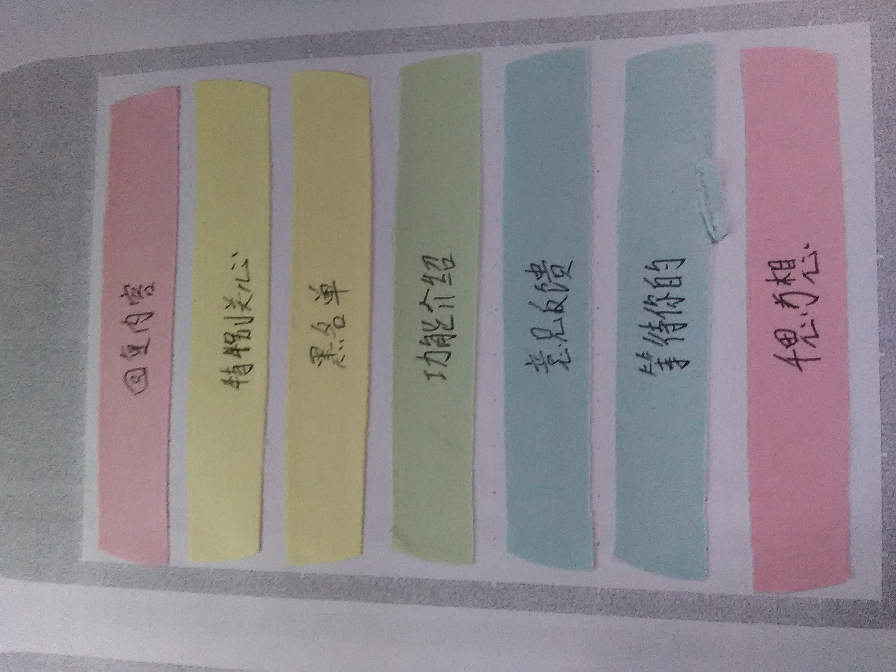
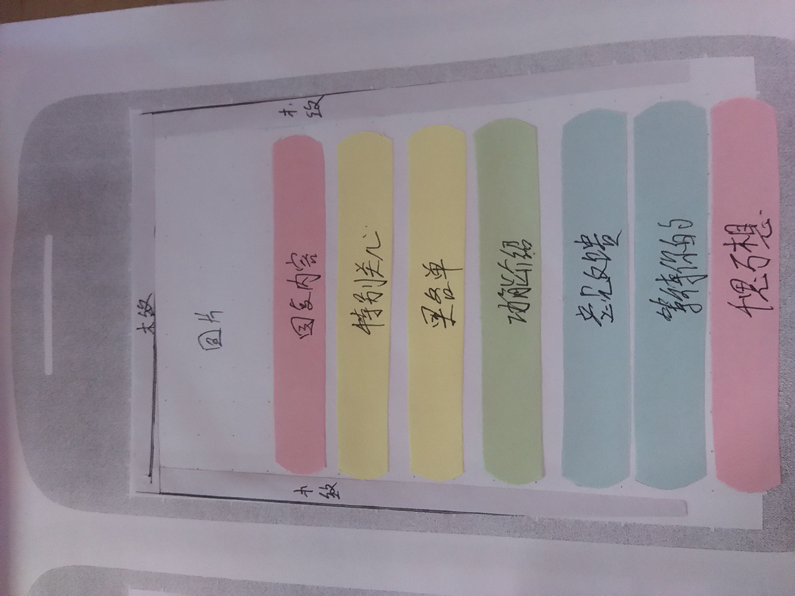
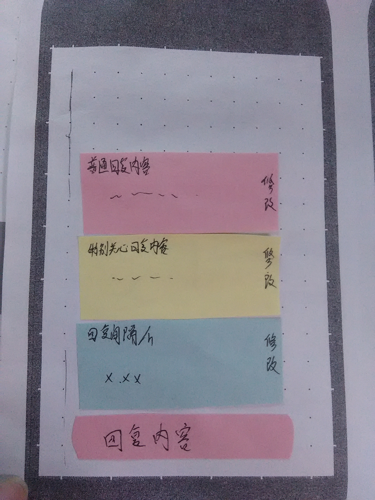
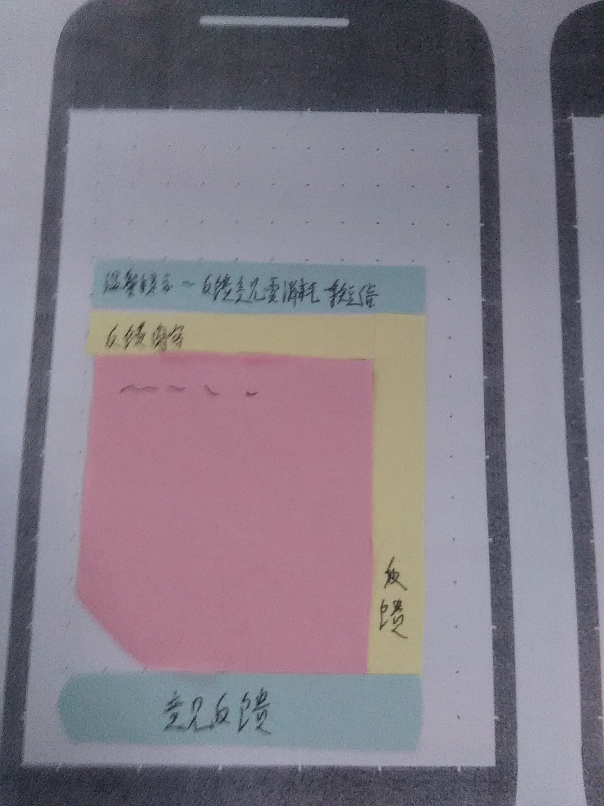
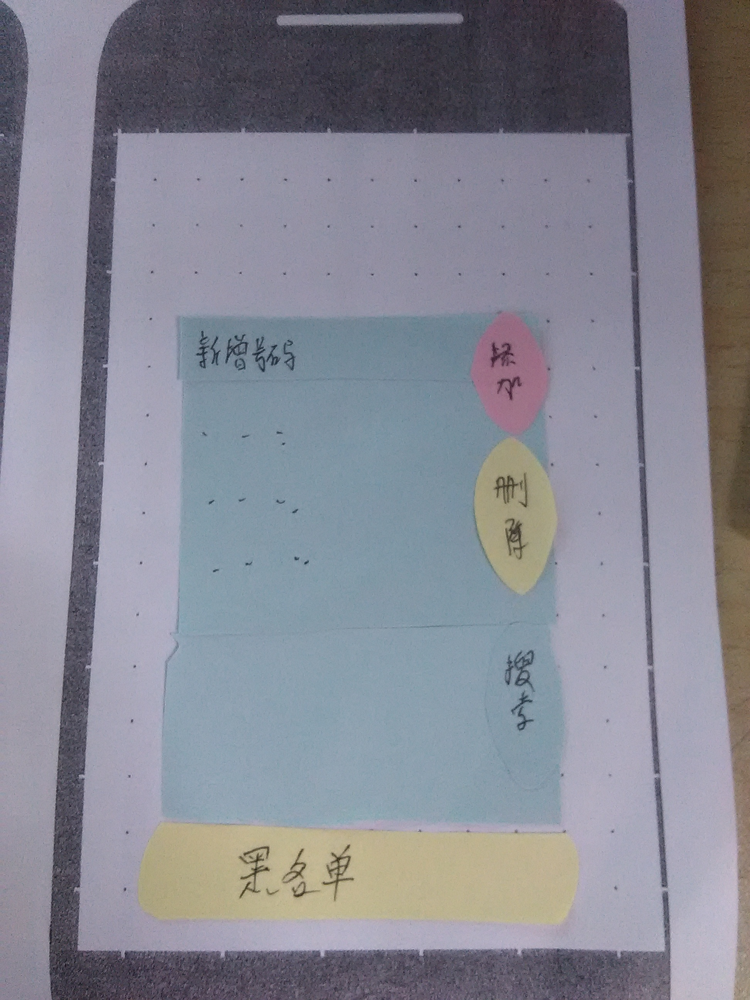
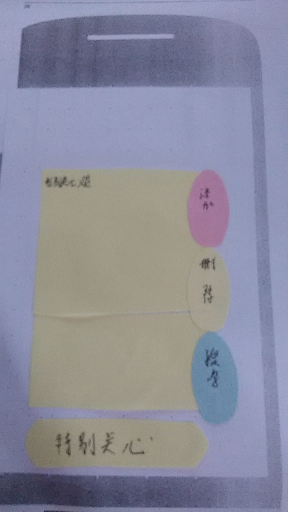

##作品功能及原型设计
---
####整体功能结构
* 当软件启动时，对不在黑名单内电话号码给予短信回复，且对符合条件的电话号码分成两部分，普通号码和特别关心号码，分别给予不同回复内容。

####具体功能模块设计
* 黑名单人员可手动添加与删除。
* 特别关心号码可从通讯录中添加，也可删除。
* 可设定回复间隔时间，即在此时间段内只对多次拨来的同一号码回复一条短信。
* 两类短信回复内容均可自行设定。

[go back](SUMMARY.md)

####界面设计
* 
* 
* 
* 
* 
* 

[go back](SUMMARY.md)