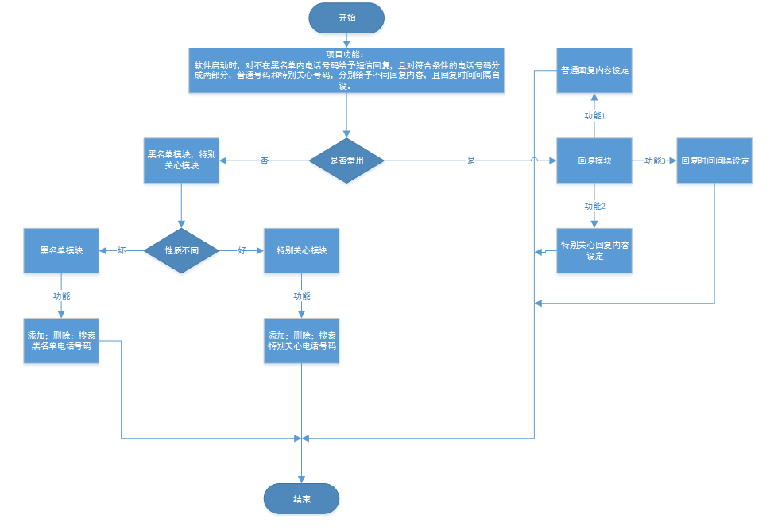
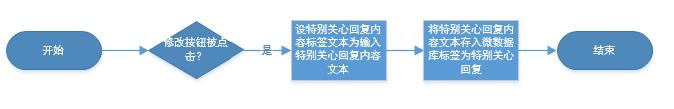
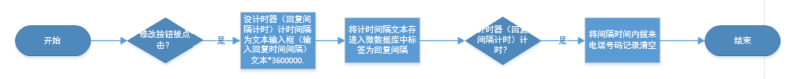
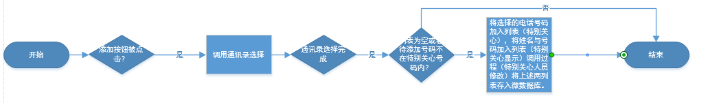
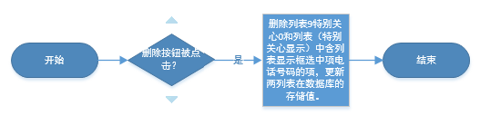
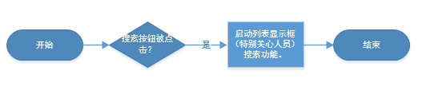
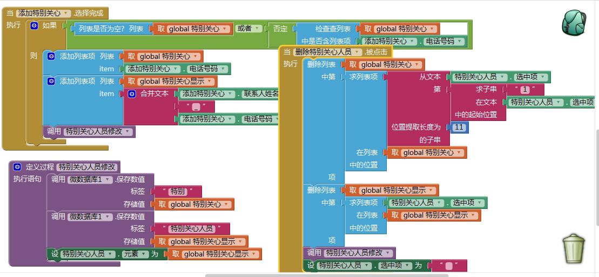

##作品实现、特色和难点
---
####作品实现
#####作品功能的分解
* 流程图

#####各模块具体实现
######回复模块
 * 普通回复内容
  * 流程图
  * 运用组件及技术：按钮，文本输入框，标签，微数据库；
 * 特别关心回复内容
  * 流程图
  * 运用组件及技术：按钮，文本输入框，标签，微数据库；
 * 回复间隔设置
  * 流程图
  * 运用组件及技术：按钮，文本输入框，标签，计时器，微数据库；

######特别关心模块
 * 特别关心号码添加
  * 流程图
  * 运用组件及技术：联系人选择框，列表显示框，微数据库；
 * 特别关心号码删除
  * 流程图
  * 运用组件及技术：按钮，列表显示框，微数据库；
 * 特别关心号码搜索
  * 流程图
  * 运用组件及技术：按钮，列表显示框；
 * 主要积木块
####特色分析
* 界面特色
 * 功能选择的七个按钮分别采用红橙黄绿蓝靛紫七种颜色，当按下一个功能按钮时其余功能按钮慢慢变小后消失，再点击一下按钮其他按钮慢慢变大恢复为原来大小。
* 功能特色
 * 拥有回复间隔控件和黑名单控件，可有效防止短信被刷的悲剧现象；
 * 拥有特别关心人员特别回复功能，给予用户针对不同人员选择不同回复内容的功能。

#### 难点和解决方案
#####难点
* 在读取上次使用的数据时运用数据存取模式，但因为未将数据库标签内容为空时返回值设为空列表而设为空字符的格式导致无法将保存的列表导入列表中。
* 设计点击某色按钮其余按钮逐渐缩小至消失；以及再次点击此色按钮其余按钮逐渐恢复至原始大小时遇到了如何实现的问题。

#####解决方案
* 询问老师发现错误得以解决，发现自己缺少发散思维。
* 

[go back](SUMMARY.md)